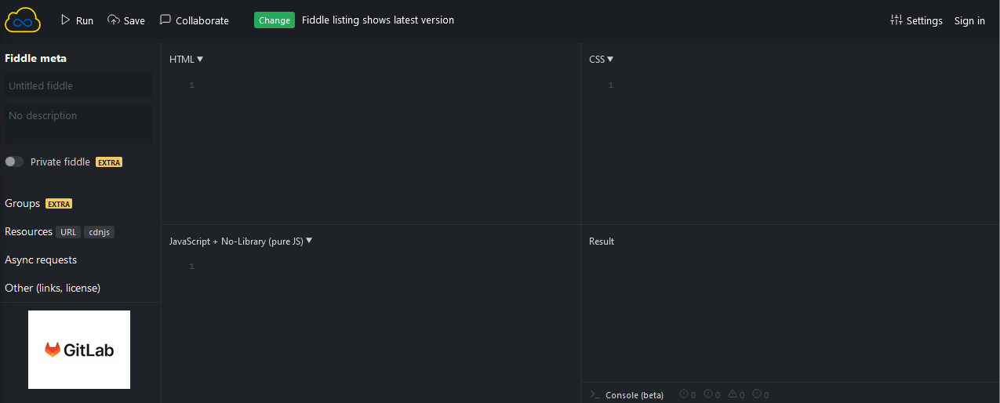
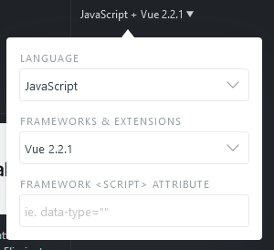
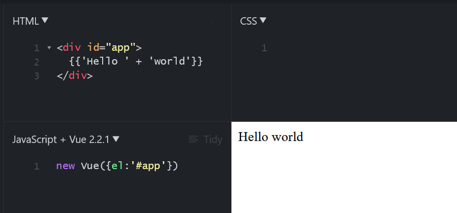
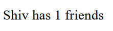
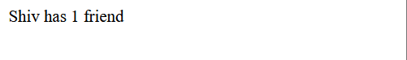

<link rel="stylesheet" href="../style.css" />


# 🟪 Chapter 1: Getting Started with Vue.js

* In this chapter the following will be covered:

- Writing Hello World with Vue.js

- Writing lists

- Creating a dynamic and animated list

- Reacting to events such as clicks and keystrokes

- Choosing a Development environmentr

- Formatting text with filters

- Debugging application with mustached

- X-raying your application with Vue developer tools

# 🧠 1.1 Introduction

* In this chapter we shall see how to leverage te liwghtweight and easy to use Vue.js framework to create applications where an element is repeated, build interactive page with event listeners.

* Note: this chapter will use ES5u but subsequent chapters shall use ES6.

# 🧠 1.2 Writing Hello World with Vue.js

## 🟦Demo:

* In this exercise, we shall use JSFiddle to write our code: [https://jsfiddle.net/](https://jsfiddle.net/)

* Navigating to the website:



* We shall instruct JSFiddle to use the Vue library. We click on the JavaScript text in the bottom right corner and set the Framework to Vue 2.2.1:

 

* We create our Hello world app by instantiating the `Vue` class in the JavaScript quadrant:

```javascript
new Vue({el:'app'})
```

* We write the following in the HTML quadrant:

```html
<div id="app">
    {{'Hello ' + 'world}}
</div>
```

* Running the app:



### How it works

* The `Vue` instance was instantiated, it accepted an options object as a parameter. This is the central object of Vue - it defines and controls data and behaviour

* We specified the `el` option which accepts a selector or an element as an argument. This specifies the scope for Vue.

* JSFiddle takes everything with the HTML quadrant and wraps it in body tags

* The moustaches `{{}}` instructs Vue to parse everything within it as code. The code within the moustaches was just simple string concatenation in JavaScript 

* We could also place expressions within the moustaches:

```javascript
Shiv has {{0+1}} friends
```



* We can  use databinding to put numbers within variables

```javascript
<div id="app">
    Shiv has {{numberOfFriends}} friend{{numberOfFriends==1?"":"s"}}
</div>

new Vue({
    el: '#app',
    data{ {numberOfFriends: 1}
})
```



* The HTML gets updated automatically whenever numberOfFriends is changed!✅


# 🧠 1.1 Spring Boot

## 🟦

## 🖥️ Code Demo 🖥️

